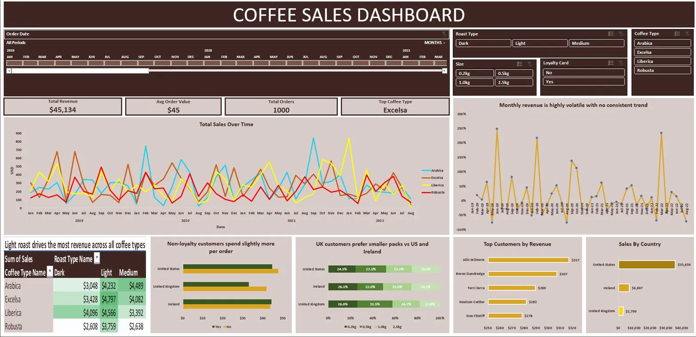

# ☕ Coffee Sales Intelligence Dashboard

An Excel business intelligence dashboard analyzing 1,000+ coffee orders across 3 markets (United States, Ireland, United Kingdom) from 2019–2022, built to surface actionable insights from raw sales data.

## 📊 Dashboard Preview

## 🔍 Business Questions Answered
- Which coffee + roast combination drives the most revenue?
- Does the loyalty card programme actually increase spend?
- Do different markets prefer different pack sizes?
- Is monthly revenue growing or declining month over month?

## 💡 Key Insights
- **US dominates revenue** — United States accounts for 79% ($35,639) of total revenue across all markets
- **Light roast is the top performer** — drives the highest revenue across all 4 coffee types
- **Loyalty card isn't working** — non-loyalty customers spend slightly more per order, suggesting the programme needs review
- **UK prefers smaller packs** — 31.5% of UK orders are 0.5kg vs only 17.8% for 2.5kg, unlike US and Ireland
- **Revenue is volatile** — monthly growth swings between -100% and +250% with no consistent seasonal pattern

## 🛠️ Excel Techniques Used
- Pivot Tables & Pivot Charts
- SUMPRODUCT, AVERAGEIFS, INDEX/MATCH
- Conditional Formatting (colour scale heatmap)
- Dynamic KPI cards
- Timeline + 6 slicers (Coffee Type, Roast, Size, Country, Loyalty Card)

## 📁 Files
- `CoffeeSalesDashboard.xlsx` — fully interactive dashboard
